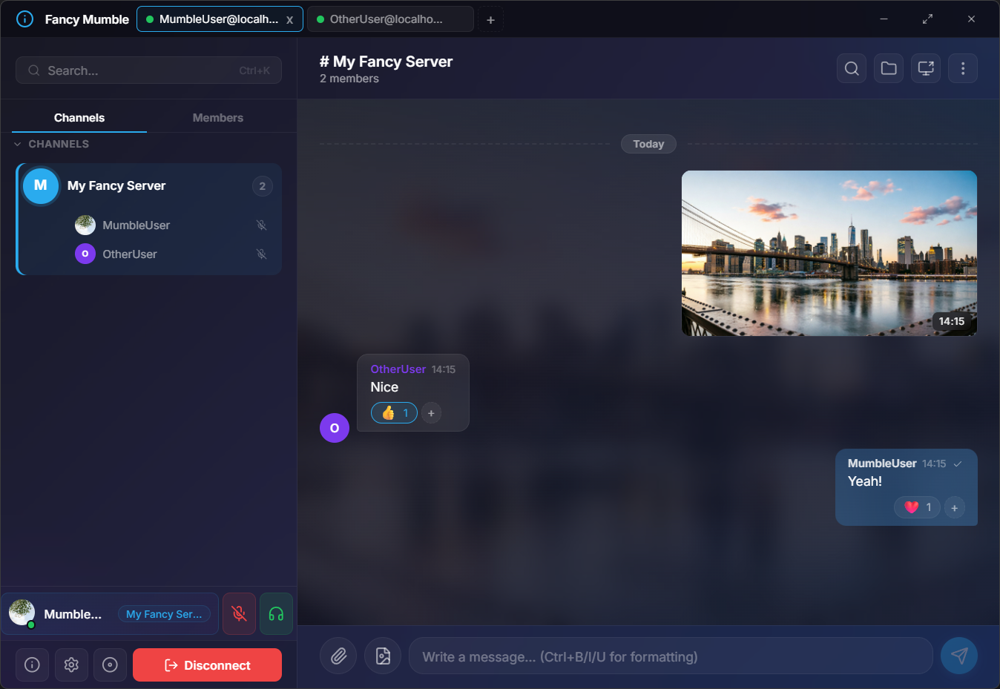
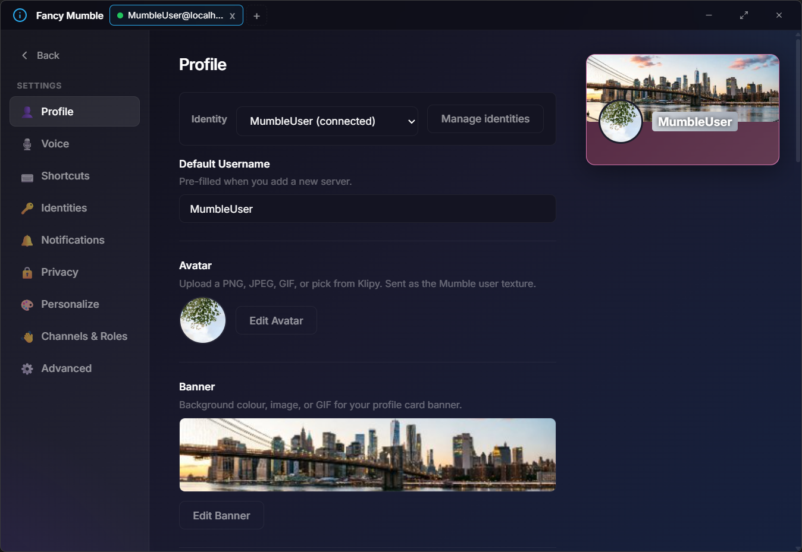
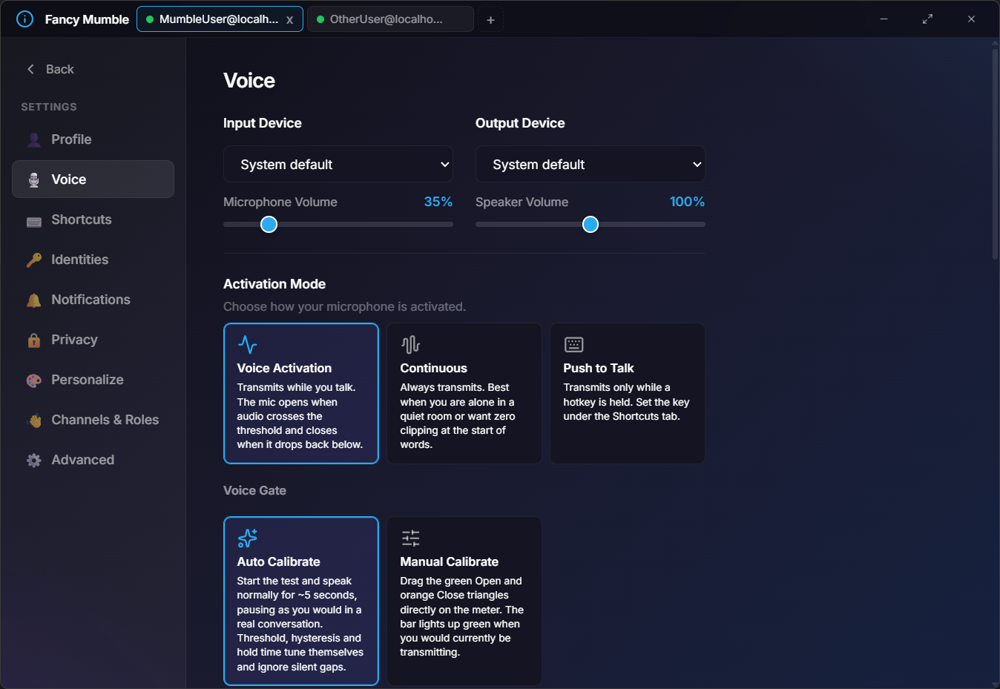

<div align="center">

# Fancy Mumble

### A Modern, Feature-Rich Mumble Client

[](LICENSE)
[](https://www.rust-lang.org/)
[](https://www.typescriptlang.org/)
[](https://reactjs.org/)
[](https://tauri.app/)

**Fancy Mumble** brings modern UI/UX design and powerful customization features to the legendary [Mumble](https://www.mumble.info/) voice chat platform.

Built with **Rust** for rock-solid performance and **React** for a sleek, responsive interface.

[Features](#features) • [Screenshots](#screenshots) • [Getting Started](#getting-started) • [Building](#building) • [Server](#related-projects)

</div>

---

## Overview

Fancy Mumble is a next-generation desktop client for Mumble that combines the reliability of the battle-tested Mumble protocol with modern features users expect in 2026. Whether you're coordinating with your gaming guild, hosting a podcast, or running a community server, Fancy Mumble delivers crystal-clear voice communication with style.

> **Status:** Active development - Core features are functional, but expect some rough edges as we polish the experience.

---

## Features

- **Crystal-clear voice** - Opus codec with AI-powered noise suppression (DeepFilterNet3), AGC, and noise gate
- **Rich chat** - Markdown formatting, inline images, GIF picker, and interactive polls
- **Profile customization** - Custom avatar frames, banners, nameplates, and WYSIWYG bio editor
- **Modern glassmorphic UI** - Responsive design for desktop and Android
- **Flexible voice controls** - Push-to-talk, voice activity detection, per-channel listening
- **Secure** - TLS encryption, self-signed certificates, no telemetry
- **Cross-platform** - Windows, Linux, and Android support

---

## Screenshots

### Main Interface

*The main view - channels on the left, chat in the middle, user info on the right*

### Profile Customization

*Customize your profile with frames, banners, and a bio editor*


### Audio Settings

*Configure your mic settings and enable AI noise suppression*

---

## Architecture

Fancy Mumble is built as a Rust workspace with multiple crates:

| Crate | Purpose |
|-------|---------|
| [`mumble-protocol`](crates/mumble-protocol) | Core Mumble protocol implementation - TCP/UDP, TLS, Opus, audio pipeline |
| [`mumble-tauri`](crates/mumble-tauri) | Tauri desktop app - native audio I/O, backend commands, state management |
| [`mumble-tauri/ui`](crates/mumble-tauri/ui) | React frontend - chat UI, profile editor, settings |
| [`fancy-denoiser-deepfilter`](crates/fancy-denoiser-deepfilter) | AI noise suppression using DeepFilterNet3 |
| [`fancy-utils`](crates/fancy-utils) | Shared utility functions |

**Tech Stack:** Rust + Tauri 2 + React 19 + TypeScript 5 + Tokio async runtime

For detailed documentation, see [`crates/mumble-protocol/doc/`](crates/mumble-protocol/doc/).

---

## Getting Started

### Prerequisites

- **Rust** (stable, edition 2021 or later) - [Install via rustup](https://rustup.rs/)
- **Node.js** (v22 or later) - [Download from nodejs.org](https://nodejs.org/)
- **Tauri CLI** - Install with: `cargo install tauri-cli --version "^2"`

#### Platform-Specific Dependencies

**Linux:**
```bash
sudo apt-get update
sudo apt-get install -y \
  libwebkit2gtk-4.1-dev \
  libappindicator3-dev \
  librsvg2-dev \
  patchelf \
  libasound2-dev \
  libgtk-3-dev \
  libsoup-3.0-dev \
  libjavascriptcoregtk-4.1-dev
```

**Android:**
See [ANDROID_DEV.md](ANDROID_DEV.md) for complete Android development setup instructions.

### Quick Start

1. **Clone the repository**
   ```bash
   git clone https://github.com/Fancy-Mumble/FancyMumble.git
   cd FancyMumble
   ```

2. **Install frontend dependencies**
   ```bash
   cd crates/mumble-tauri/ui
   npm install
   cd ../../..
   ```

3. **Run the development server**
   ```bash
   cd crates/mumble-tauri
   cargo tauri dev
   ```

The app will launch with hot-reloading enabled for both Rust and TypeScript changes.

---

## Building

### Desktop (Windows/Linux)

```bash
cd crates/mumble-tauri
cargo tauri build
```

Production installers will be generated in `target/release/bundle/`:
- **Windows:** `.exe` installer, `.msi` package
- **Linux:** `.deb`, `.AppImage`, `.rpm`

### Android

```bash
cd crates/mumble-tauri
cargo tauri android build
```

APK/AAB files will be in `gen/android/app/build/outputs/`.

For development with hot-reload:
```bash
cargo tauri android dev
```

Or use the helper script (Windows):
```powershell
.\scripts\android-dev.ps1 -Run
```

### Releases and update channels

Releases are cut by CI from a branch, never by hand. The version in
`crates/mumble-tauri/tauri.conf.json` is the source of truth for the tag, and
`ui/package.json` plus `crates/mumble-protocol/Cargo.toml` must agree with it
or the build fails before anything is published.

| Branch | Publishes | Visible to |
| --- | --- | --- |
| `main` | `vX.Y.Z`, flagged latest | everyone |
| `beta` | `vX.Y.Z-beta.N`, flagged pre-release | users who opted in |

A pre-release is listed on the Releases tab with GitHub's "Pre-release" marker,
but it is excluded from `releases/latest`, which is where every stable client
looks. Beta clients read a separate manifest, `beta.json`, which CI publishes on
the orphan `updater` branch after the release itself exists. It is served from
`raw.githubusercontent.com` and can lag a release by a few minutes of CDN cache.

**Cutting a beta.** Branch `beta` off `develop`, set all three version files to
the *next* stable version (e.g. `0.4.0` while `0.3.0` is released), and push. CI
appends `-beta.<run number>`, so successive pushes give `0.4.0-beta.1`,
`0.4.0-beta.2` and so on. Pushing a `beta` branch whose version is not above the
latest stable release fails the build on purpose: such a build would sort below
what testers already have and reach nobody.

**Opting in.** Settings -> Advanced -> Beta updates. The updater then checks both
manifests and offers whichever version is higher, so a tester moves onto the
stable `0.4.0` on their own the moment it ships. Turning the setting back off
does not roll an installed beta back; the client simply waits until a stable
release overtakes it. For the same reason a tester on `0.4.0-beta.3` is not
offered a `0.3.1` stable hotfix.

**What beta builds contain.** Windows NSIS installer, Linux AppImage, and the
Android APK. No MSI (the bundler rejects a non-numeric pre-release identifier)
and no `.deb` (dpkg reads `-beta.N` as a Debian revision and sorts it *above* the
final `0.4.0`, which would block the upgrade to stable). The auto-updater only
ever uses the NSIS installer and the AppImage. Every beta of a version shares one
Android `versionCode`, so betas can be sideloaded over each other but could not
be uploaded to a store alongside the stable build.

To exercise the channel logic locally without publishing anything, serve a
manifest and point a debug build at it:

```bash
python3 -m http.server 8787          # serving a directory containing beta.json
FANCY_UPDATER_BETA_URL=http://127.0.0.1:8787/beta.json cargo tauri dev
```

---

## Testing

### Frontend Unit Tests
```bash
cd crates/mumble-tauri/ui
npm test              # Single run
npm run test:watch    # Watch mode
```

### Rust Unit Tests
```bash
cargo test --package mumble-protocol --features opus-codec --lib
```

### Integration Tests

Integration tests run against a real Mumble server in Docker:

```bash
cd crates/mumble-protocol

# Start test server
docker compose -f docker-compose.test.yml up -d --wait

# Run tests
cargo test --package mumble-protocol --test integration

# Run specific test
cargo test --package mumble-protocol --test integration -- test_plugin_data_transmission_between_two_clients

# Cleanup
docker compose -f docker-compose.test.yml down
```

**Note:** Docker must be running, and port 64738 (TCP+UDP) must be available.

---

## Related Projects

### Server Implementation

Fancy Mumble works with any standard Mumble server. We maintain an enhanced fork with additional features:

**SetZero/mumble-server** - [github.com/SetZero/mumble-server](https://github.com/SetZero/mumble-server)

Key server components:
- [**Protocol Implementation**](https://github.com/SetZero/mumble-server/tree/1.6.x/src) - C++ server core (Mumble.proto, MumbleUDP.proto)
- [**User Management**](https://github.com/SetZero/mumble-server/blob/1.6.x/src/User.cpp) - User state, authentication, and permissions
- [**Channel System**](https://github.com/SetZero/mumble-server/blob/1.6.x/src/Channel.cpp) - Channel hierarchy and ACL
- [**ACL Engine**](https://github.com/SetZero/mumble-server/blob/1.6.x/src/ACL.cpp) - Access control lists and groups
- [**HTML Filtering**](https://github.com/SetZero/mumble-server/blob/1.6.x/src/HTMLFilter.cpp) - Safe HTML rendering in comments/messages
- [**Ban Management**](https://github.com/SetZero/mumble-server/blob/1.6.x/src/Ban.cpp) - Server ban system

### Official Resources

- [Mumble Official Website](https://www.mumble.info/)
- [Mumble Protocol Documentation](https://mumble-protocol.readthedocs.io/)
- [Mumble GitHub](https://github.com/mumble-voip/mumble)

---

## Contributing

We welcome contributions! Whether you're fixing bugs, adding features, improving documentation, or suggesting ideas, your help is appreciated.

**Before contributing:**
1. Check existing issues and pull requests to avoid duplicates
2. Read the [CONTRIBUTING.md](.github/CONTRIBUTING.md) guidelines
3. Review the [Copilot Instructions](.github/copilot-instructions.md) for coding conventions
4. Follow the Boy Scout Rule: leave code cleaner than you found it

**Development workflow:**
1. Fork the repository
2. Create a feature branch (`git checkout -b feature/amazing-feature`)
3. Make your changes with clear, descriptive commits
4. Run tests and linters (`cargo clippy`, `cargo test`, `npm test`)
5. Push to your fork and open a pull request

---

## License

This project is licensed under the **MIT License** - see the [LICENSE](LICENSE) file for details.

---

## Acknowledgments

- **Mumble Team** - For creating and maintaining the excellent Mumble protocol
- **Tauri Team** - For the amazing cross-platform framework
- **Rust Community** - For the incredible ecosystem and tools
- All contributors who help make Fancy Mumble better

---

<div align="center">

**Built with ❤️ by the Fancy Mumble Team**

[Report Bug](https://github.com/Fancy-Mumble/FancyMumble/issues) • [Request Feature](https://github.com/Fancy-Mumble/FancyMumble/issues) • [Join Discussion](https://github.com/Fancy-Mumble/FancyMumble/discussions)

</div>
